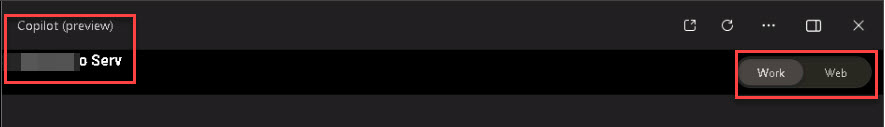

# Task 1.4: Verify apps now have Copilot 

1. Open **Microsoft Word** (or any Office 365 product) and sign in with your Microsoft 365 Admin credentials.  

1. Notice that **Copilot** is now available in the ribbon. Continue to the next step.  

     

    {: .warning }
    > If Copilot is not available, follow the steps in the expandable section. 

   

    
Expand here for instructions on downloading Office
 
    
         1. Open a new browser tab and go to **https://www.microsoft365.com/**. 
     
         1. If necessary, sign in with your Microsoft 365 Admin credentials.  
     
         1. On the Home page, select **Install and more**. 
     
          
     
         1. Select **Install Microsoft 365 apps**. 
     
         1. Under **Office apps & devices**, select **Install Office** to initiate the download. 
     
         1. Once the download is complete, run the **OfficeSetup** Application to install the apps. 
     
         {: .note }
         > Wait several minutes for the installation to complete. 
     
          
     
         1. Select **Close**. 
     
          
     
         1. On the Desktop, go to **Settings** > **Apps** > **Installed apps**. 
     
         1. Verify that the following apps are listed: 
     
         - **Microsoft 365 (Office)** 
     
         - **Microsoft 365 Apps for enterprise** 
    
         1. Close the **Settings** window. 
     
         1. On the Desktop, in the search box, search for and open the following to verify the Microsoft 365 apps installation: 
     
         - **Microsoft Word** 
         - **Microsoft Excel** 
         - **Microsoft Outlook** 
         - **Microsoft Powerpoint** 

     
 

1. Open **Copilot (preview)**. 

     

1. If necessary, sign in with your Microsoft 365 Admin credentials. 

     

1. Notice the license domain is now listed and there are tabs for **Work** and **Web**.  

     

1. Select **Web**. 

1. Notice that the prompts are now protected. 

     
 
{: .important }
> Copilot in Windows: work and school accounts 
> Copilot in Windows uses Microsoft Copilot, but if you’re signed into your Windows device with a work or school account, your IT administrator might have policies that change or disable Copilot in Windows. You might see Copilot in Windows using the following chat providers instead of Microsoft Copilot: 
> - Microsoft Copilot with commercial data protection (formerly known as Bing Chat Enterprise) 
> - Microsoft Copilot with Graph-grounded chat (formerly known as Microsoft 365 Chat)  
> When you're using Copilot with commercial data protection, chat history isn't available, and the chat pane displays the following message: Your personal and company data are protected in this chat.  
> Students typically don't have access to Copilot in Windows, but faculty members and higher education students over 18 years of age may have access to Copilot with commercial data protection.
