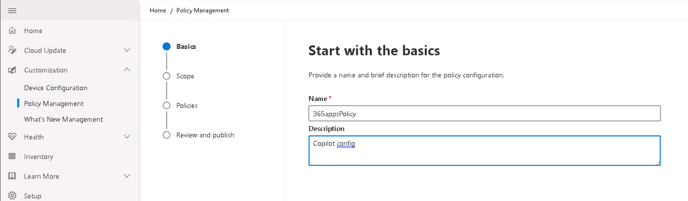

# Task 2.2: Create a Policy configuration 

 

1. Return to the Microsoft 365 Apps admin center home page or open a new browser tab and go to **https://config.office.com/**. 

 

1. On the left navigation, select **Customization** > **Policy Management**.  

 

1. Select **Create**. 

 

1. On the **Basics** page, do the following and select **Next**: 

 

    - Enter a name for the policy configuration.  

    - Enter a description. 

 

    >Example Input: 

     

 

1. On the **Scope** page, select **This policy configuration applies to all users** and then select **Next**. 

 

1. On the **Policies** page, review the available policy settings. 

 
    {: .note }
    > There are over 2200 policies listed. Use the search box to locate specific topics. 

 
    {: .note }
    > Here are some interesting policies that can be configured.    

    > 

    - Turn off Coming Soon 

    - Disable Document Information Panel 

    - Disable web templates in File | New and on the Office Start screen 

    - Disable the Office Start screen for all Office applications 

    - Block the Office Store 

    - Use CTRL + Click to follow hyperlinks 

    - Turn off Draft with Copilot in Outlook 

 
    {: .highlight }
    > Optionally, select a policy and configure it. Then test to see if it was applied to the tenant. 

 

1. Select **Next**.     

 

1. On the **Review and publish** page, review the settings for your policy configuration and then select **Create**. 

 

     

 

1. Once the policy configuration is created, select **Done**. 

 

1. On the Policy configurations page, verify that the policy is listed. 

 
{: .important }
> [Overview of Cloud Policy service for Microsoft 365 - Deploy Office | Microsoft Learn](https://learn.microsoft.com/en-us/deployoffice/admincenter/overview-cloud-policy "Overview of Cloud Policy service for Microsoft 365 - Deploy Office | Microsoft Learn") 

 
