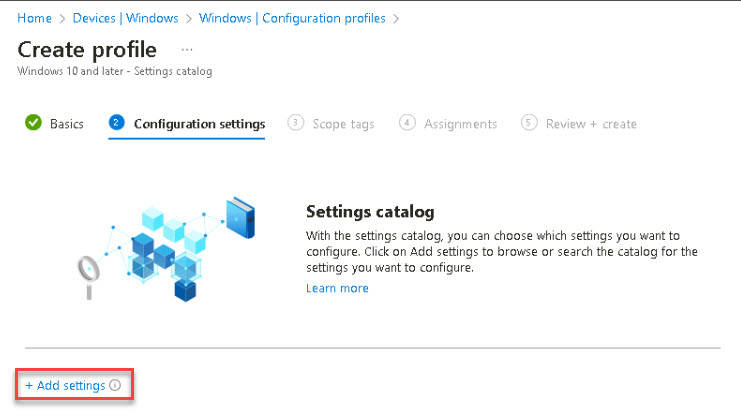

# Task 2.4: Enable Cloud Update

1. Open a new browser tab and go to [https://endpoint.microsoft.com/](https://endpoint.microsoft.com/).

1. If necessary, sign in with your Microsoft 365 credentials.

1. On the left navigation, select **Devices**.

1. On the left pane, under **By platform**, select **Windows**.

1. On the left pane, under **Windows policies**, select **Configuration profiles**.

1. Under the **Policies** tab, select **+ Create** > **+ New Policy**.

    

1. On the **Create a profile** window, enter the following:

    | Default | Value |
    |:---------|:---------|
    | Platform   | **Windows 10 and later**   |
    | Profile type   | **Settings catalog**   |

1. Select **Create**.    

1. From the **Create profile** page, on the **Basics** tab, provide a name for this profile and select **Next**.

    {: .highlight}
    > For example: **Profile – Turn off Copilot**. 

1. From the **Configuration settings** tab, select **+ Add settings**.

    

1. From the **Settings picker** flyout, search for **copilot** and under **Browse by category** select **Windows AI**.

1. On the lower-half of the flyout, select the **Turn Off Copilot in Windows (User)** checkbox and then close the **Settings picker** window.

    {: .warning }
    > Be sure to select the Setting name checkbox to add the setting for configuration. Once added, select the corresponding configuration.

1. Verify that **Turn Off Copilot in Windows (User)** is disabled.

    

1. Select **Next**.

1. From the **Scope tags** tab, review the page and then select **Next**.

1. From the **Assignments** tab, select **Add all users** and select **Next**.

1. On the **Review + create** tab, review the page and then select **Create**.

            

1. Refresh the browser page and verify that the policy is listed.

Expand here for information on Updating Microsoft 365 Apps for Windows 10 or later assignments

    
## Update Microsoft 365 Apps for Windows 10 or later assignments
    
If you're deploying Microsoft 365 Apps with Intune using the Microsoft 365 Apps for Windows 10 and later app, the channel selected in the app configuration is re-evaluated and enforced during policy refresh. If the channels don't match, this causes unexpected channel flipping under the following circumstances:

Deploying Microsoft 365 Apps using the Microsoft 365 Apps for Windows 10 and later app.

- The app is configured using the Configuration designer.
- The app is assigned as required.
- The selected channel differs from the newly assigned one.
    
If this matches your current configuration, adjust your Microsoft 365 Apps for Windows 10 or later apps:
    
- Update the configuration of the existing app to exclude the Microsoft Entra ID security groups you created for the channel change.
- Create new Microsoft 365 Apps for Windows 10 or later apps with the newly assigned update channel.
    
If you're moving devices to both Current and Monthly Enterprise Channel, you have to create two new apps. Assign the newly created apps to the respective Microsoft Entra ID security groups.

