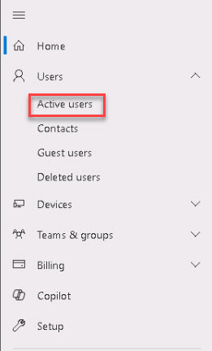
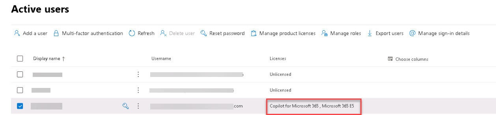

# Task 1.2: Assign a Copilot for Microsoft 365 license

1. Open a browser and go to the Microsoft 365 admin center at **[admin.microsoft.com](https://admin.microsoft.com)**.

1. Sign in with your Microsoft 365 Admin credentials.

    {: .warning }
    > If the account is new or has never been setup, use the **Get started** wizard to complete setup and register the domain.

1. On the left navigation, select **Users** > **Active users**.

            

1. On the **Active users** page, select the checkbox next to your user **Display name**.

1. On the **Licenses and apps** tab, under **Licenses**, select the **Copilot for Microsoft 365**.

    {: .note }
    > Verify that your Microsoft 365 E5 license is selected.

    

1. Review the welcome email option.

1. Select **Save changes**.

1. Close the user details window.

1. On the **Active users** page, under the **Licenses** column, verify that the **Copilot for Microsoft 365** license is listed for the account you're using in this lab.

    

1. Minimize the browser. You'll be using it later.
