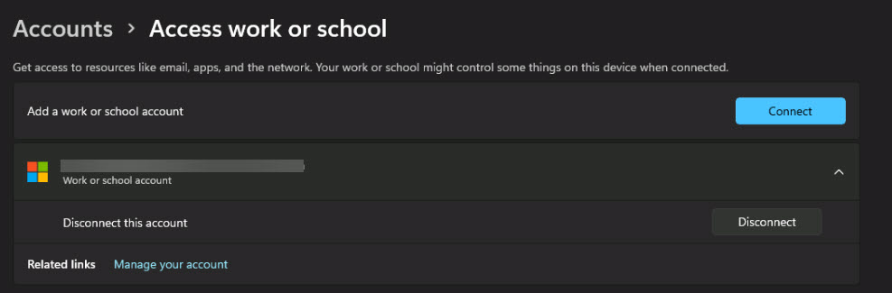

# Task 1.3: Register a Windows device to Microsoft 365  

1.  On your Windows 11 device, go to **Settings** > **Accounts**.   

 

1.  Select **Access work or school**, and then next to **Add a work or school account** select **Connect**. 

 

     

 

1.  Enter your Microsoft 365 Admin credentials and sign in to complete the registration.  

 

     

 

1.  Once the account is added successfully, select **Done**. 

 

1.  On the **Access work or school** page, verify that your account is listed.  

 

     

 

1.  Close the **Settings** window. 

 
