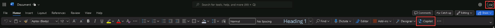
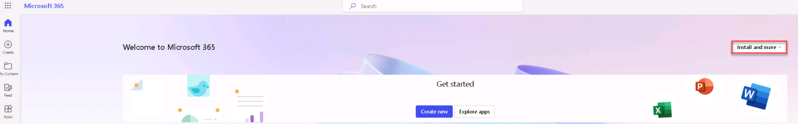
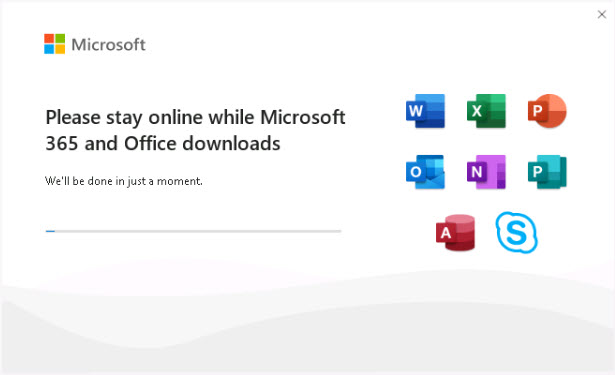
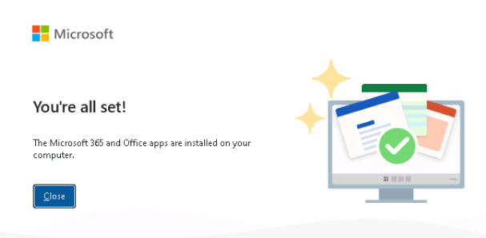
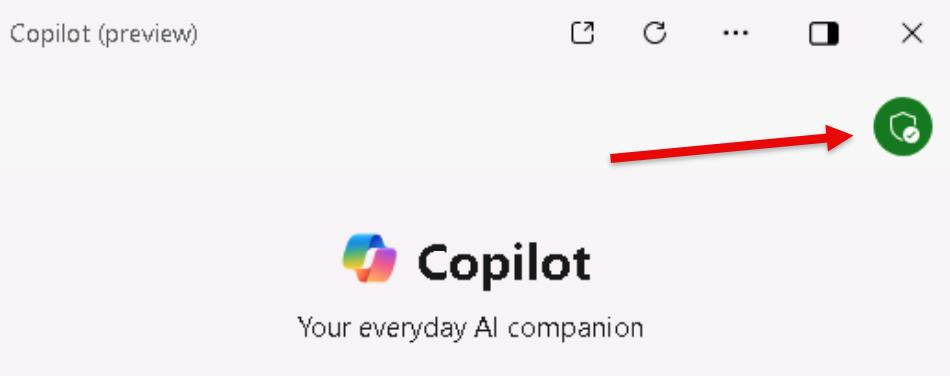

# Task 1.4: Verify apps now have Copilot 

1. Open **Microsoft Word** and create a new blank document. 

1. Notice that **Copilot** is now available on the ribbon.  
If you do not see **Copilot** on the ribbon, sign out and sign back in to Microsoft Word.

   

   {: .warning }
   > If Copilot is not available, follow the steps in the expandable section to install the latest updates for Microsoft 365 apps.
  
      

           

   
Expand here for instructions on downloading Microsoft 365 apps

            

   1. Open a new browser tab and go to Microsoft 365 at [https://www.microsoft365.com](https://www.microsoft365.com).

   1. If necessary, sign in with your Microsoft 365 credentials.

   1. On the Home page, select **Install and more**.

             

   1. Select **Install Microsoft 365 apps**.

   1. Under **Office apps & devices**, select the **32-bit** version, and then select **Install Office** to initiate the download.

   1. After the download is complete, run the **OfficeSetup** installation.  
                 Wait several minutes for the installation to complete.

       

    1. Select **Close**.

       

    1. Go to **Settings** > **Apps** > **Installed apps**.

    1. Verify that the following apps are listed:

        - **Microsoft 365 (Office)**
        - **Microsoft 365 Apps for enterprise**

    1. Close the **Settings** window.

     

  
 1. Open **Copilot in Windows (preview)**.

 1. If necessary, refresh and sign in with your Microsoft 365 credentials.

    

 1. Notice that the communication is now protected.

    

{: .important }
> ## Copilot in Windows: work and school accounts.
>
> Copilot in Windows uses Microsoft Copilot, but if you're signed into your Windows device with a work or school account, your IT administrator might have policies that change or disable Copilot in Windows. You might see Copilot in Windows using the following chat providers instead of Microsoft Copilot:
> - Microsoft Copilot with commercial data protection (formerly known as Bing Chat Enterprise)
> - Microsoft Copilot with Graph-grounded chat (formerly known as Microsoft 365 Chat) 
>
When you're using Copilot with commercial data protection, chat history isn't available, and the chat pane displays the following message: Your personal and company data are protected in this chat. 
>
Students typically don't have access to Copilot in Windows, but faculty members and higher education students over 18 years of age may have access to Copilot with commercial data protection.

