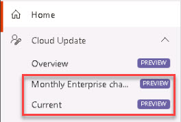

# Task 2.1: Enable Cloud Update

To use Microsoft 365 Copilot, Microsoft 365 Apps must run on Current or Monthly Enterprise Channel. With the enablement of cloud updates, the service automatically manages all Microsoft 365 Apps installations on Monthly Enterprise Channel. To keep all devices updated, we recommend enabling the profile for Current Channel as well.

Cloud update provides a modern update management solution for Microsoft 365 Apps. Use cloud update to address common servicing needs with features such as custom rollout waves, exclusion windows, pause, and rollback. It works for organizations of any size, handling compatibility concerns for larger environments, while offering simpler controls for smaller businesses. In addition, cloud update makes Copilot readiness easier with the ability to move devices to a compatible update channel and maintain monthly updates with minimal administrative effort.

>{: .important } 
> Cloud update is the successor to servicing profile. If you still see servicing profile in the Microsoft 365 Apps admin center, your tenant has been temporarily held back from the upgrade due to the use of Device selection criteria > Choose groups to include. This option is not available with cloud update. Please review the onboarding behavior for cloud update, which uses channel to profile mapping for discovering and managing eligible devices.

1. Open a new browser tab and go to the Microsoft 365 Apps admin center at **[https://config.office.com/](https://config.office.com/)**. 

    

1. Sign in with your Microsoft 365 Admin credentials. 

    > {: .warning }
    >  Be sure to sign in using an account that has the Office Apps Administrator, Security Administrator, or Global Administrator role if you are not using the same account for administrative tasks and user tasks.
 

1. On the **Recommendation based on your tenant** card, select **Enable cloud**. 

 

     

     
    {: .note }
    > Wait a moment and refresh the page. 

 

1. On the left navigation, expand **Cloud Update** and verify that the **Monthly Enterprise** and **Current** entries are listed. 

 

     

 
    {: .important }
    > [Change update channel of Microsoft 365 Apps to enable Copilot](https://learn.microsoft.com/en-us/deployoffice/updates/change-channel-for-copilot "Change update channel of Microsoft 365 Apps to enable Copilot") 

 
