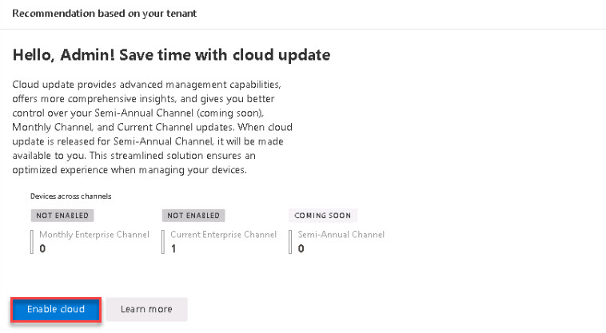

# Task 2.1: Enable Cloud Update

To use Copilot for Microsoft 365, Microsoft 365 Apps must run on Current or Monthly Enterprise Channel. With the enablement of Cloud Updates, the service automatically manages all Microsoft 365 Apps installations on Monthly Enterprise Channel. To keep all devices updated, we recommend enabling the profile for Current Channel as well.

1. Open a new browser tab and go to **[https://config.office.com/](https://config.office.com/)**. 

 

1. Sign in with your Microsoft 365 Admin credentials. 

 

1. On the **Recommendation based on your tenant** card, select **Enable cloud**. 

 

     

     
    {: .note }
    > Wait a moment and refresh the page. 

 

1. On the left navigation, expand **Cloud Update** and verify that the **Monthly Enterprise** and **Current** entries are listed. 

 

     

 
    {: .important }
    > [Change update channel of Microsoft 365 Apps to enable Copilot](https://learn.microsoft.com/en-us/deployoffice/updates/change-channel-for-copilot "Change update channel of Microsoft 365 Apps to enable Copilot") 

 
