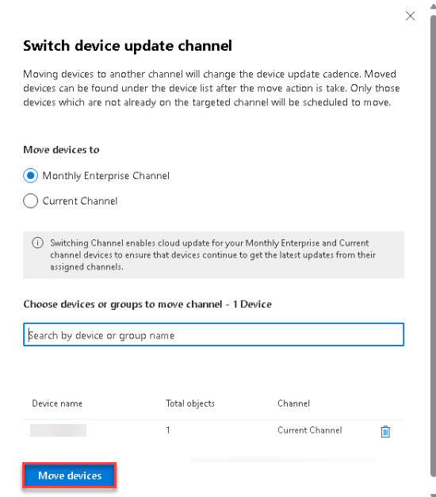

# Task 2.2: (Optional Task) Initiate a channel change

1. On the left navigation, select **Inventory**.  

1. Near the bottom of the page, select **Show all devices**. 

1. On the **Devices** page, select **Switch device update channel**. 

1. On the **Switch device update channel** window, select the **Monthly Enterprise Channel** option. 

1. In the **Choose devices or groups to move channel** box, enter the name of your device. 

1. Select **Move devices** to initiate the channel change. 

       

1. When complete, confirm the move was scheduled and then close the **Channel move was scheduled** pane.

     
 
{: .warning }
> It might take up to 24 hours for the channel change to be completed by the device, assuming devices are online and can connect to the service. Come back later to verify. Proceed to the next task.

{: .important }
> A channel change is a point-in-time activity. If you are using Microsoft Entra ID groups and add devices or users to the group after initiating a channel change, those devices will not be moved automatically. You will have to initiate the channel change again. There's no need to remove already switched devices from the group.
>
>
You can validate the implementation by monitoring the following aspects:
>
- Within 24 hours, you should see the devices being listed in the Monthly Enterprise or Current profile.
>
- Within 24 hours, you should see the Update Channel changing to the targeted one in inventory.
>
- On the device, the following registry key should change to "1", as profile's control is established on the device:
    - HKEY_LOCAL_MACHINE\SOFTWARE\Policies\Microsoft\cloud\office\16.0\Common\officeupdate > IgnoreGPO
>
- Other apps like Visio, Project or Access Runtime are migrated to Current Channel as well and are updated in the same pass.
