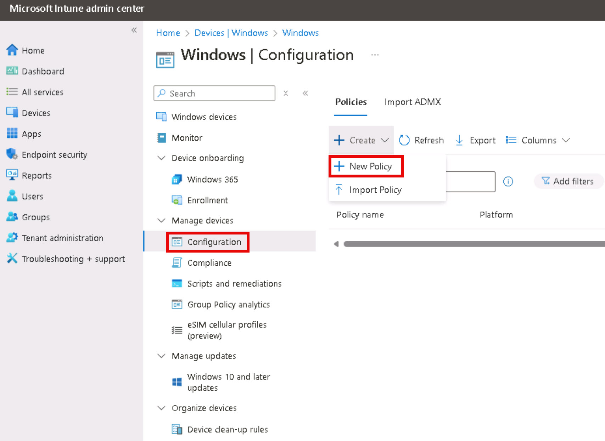

# Task 2.4: Enable Cloud Update

1. Open a new browser tab and go to the Microsoft Intune admin center at [https://endpoint.microsoft.com](https://endpoint.microsoft.com)

1. If necessary, sign in with your Microsoft 365 administrator credentials.

1. On the left navigation, select **Devices**.

1. On the left pane, under **By platform**, select **Windows**.

1. On the left pane, under **Manage devices**, select **Configuration**.

1. Under the **Policies** tab, select **+ Create** > **+ New Policy**.

    

1. On the **Create a profile** pane, enter the following:

    | Setting | Value |
    |:---------|:---------|
    | Platform   | Windows 10 and later  |
    | Profile type   | Settings catalog  |

1. Select **Create**.    

1. On the Create profile page, on the **Basics** tab, enter +++**Profile – Turn off Copilot**+++ and then select **Next**.

1. On the **Configuration settings** tab, select **+ Add settings**.

    

1. On the **Settings picker** pane, search for +++**Copilot**+++.

1. Under **Browse by category**, select **Windows AI**.

1. Under **Settings name**, select the **Turn Off Copilot in Windows (User)** checkbox and then close the **Settings picker** window.

    >{: .warning } Be sure to select the Setting name checkbox to add the setting for configuration.

1. Verify that **Turn Off Copilot in Windows (User)** is disabled.

    {300}

    > {: .note } For this lab, the policy is being created to demonstrate how a policy can be configured and settings applied when the policy is assigned. We do not want to turn off Copilot in Windows for this lab.

1. Select **Next**.

1. On the **Scope tags** tab, review the information and then select **Next**.

1. On the **Assignments** tab, select **Add all users** and select **Next**.

1. On the **Review + create** tab, review the policy and then select **Create**.

    {400}

1. Refresh the **Policies** list and verify that the policy is listed.

    >{: .warning } Configuration profiles can take 24+ hours to activate. Come back later to test that the profile is enforced.

>{: .highlight }

Expand here for information on Updating Microsoft 365 Apps for Windows 10 or later assignments

>
>#### Update Microsoft 365 Apps for Windows 10 or later assignments
>
>If you're deploying Microsoft 365 Apps with Intune using the Microsoft 365 Apps for Windows 10 and later app, the channel selected in the app configuration is re-evaluated and enforced during policy refresh. If the channels don't match, this causes unexpected channel flipping under the following circumstances:
>
Deploying Microsoft 365 Apps using the Microsoft 365 Apps for Windows 10 and later app.
- The app is configured using the Configuration designer.
- The app is assigned as required.
- The selected channel differs from the newly assigned one.
>
If this matches your current configuration, adjust your Microsoft 365 Apps for Windows 10 or later apps:
>
- Update the configuration of the existing app to exclude the Microsoft Entra ID security groups you created for the channel change.
- Create new Microsoft 365 Apps for Windows 10 or later apps with the newly assigned update channel.
>
If you're moving devices to both Current and Monthly Enterprise Channel, you have to create two new apps. Assign the newly created apps to the respective Microsoft Entra ID security groups.

