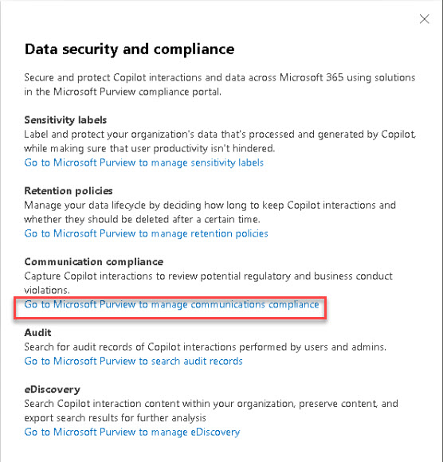
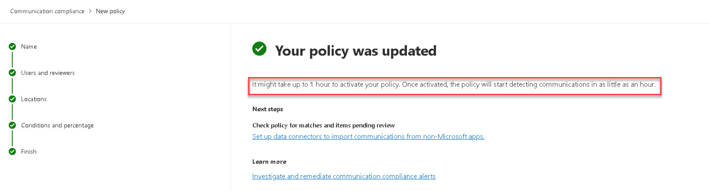
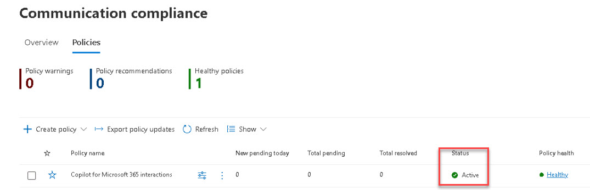

# Task 3.2: Create a compliance policy

Microsoft Purview Communication Compliance provides the tools to help organizations detect regulatory compliance (for example, SEC or FINRA) and business conduct violations such as sensitive or confidential information, harassing or threatening language, and sharing of adult content. 

Built with privacy by design, usernames are pseudonymized by default, role-based access controls are built in, investigators are opted in by an admin, and audit logs are in place to help ensure user-level privacy.

1. Select **Data security and compliance**.

1. Under **Communication compliance**, select **Go to Microsoft Purview to manage communications compliance**. 

    

1. Go to the Communication Compliance solution.

1. Review the Overview page.

1. Select **Policies**.

1. Select **+ Create policy** > **Detect Copilot for Microsoft 365 interactions**.

1. Enter the policy name, select the users and groups to apply the policy to, and then select the reviewers for the policy.

    {: .note }
    > [Learn more about these options when creating a policy from a template](https://learn.microsoft.com/en-us/purview/communication-compliance-configure#create-a-policy-from-a-template "Optional link title")

1. Review the list of settings chosen for you based on the template.

1. Select **Customize policy** and add your account as a **Reviewer**, then select **Create policy** to create the policy.

1. Notice that it may take up to 1 hour to activate your policy.

    

1. Select **Done**.

1. After the activation period has concluded you can verify that the policy status is now **Active**.

    

{: .warning }
> Policies can take 24+ hours to activate. Come back later to test the compliance policy.
