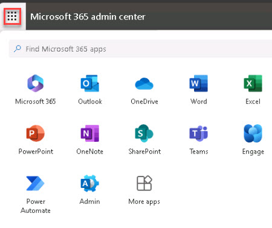
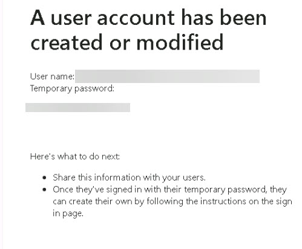

# Task 2.1: Access Outlook

1. In the Microsoft 365 admin center, in the upper left of the page, select **App launcher**. 

 

     

 

1. Select **Outlook**. 

 

1. In the **Inbox**, locate the **Microsoft on behalf of your organization** email and notice that it contains the user credentials for the user you created in the previous exercise. 

 

1. Take note of the **User name** and **Temporary password**. In the next task, we will send a welcome email to the user. 

 

   

 
   {: .warning }
   > If you did not assign a Microsoft 365 E3/E5 license to the new user in the previous exercise, just send the email to yourself. 
     
