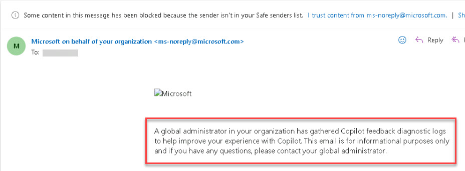

# Task 3.2: Send feedback logs for Copilot for Microsoft 365 on behalf of individual users who are having issues

1. In the Microsoft 365 admin center, on the left navigation, select **Copilot**. 

 

1. Review the information on the **Overview** page and then select **Settings**. 

 

1. Review the settings names and descriptions. 

 

1. Select **Copilot for Microsoft 365 feedback logs**. 

 

    

 

1. On the **Copilot for Microsoft 365 feedback logs** page, review the information and then select **Get started**. 

 

1. On the **Collect data** page, review the information and enter your email into the **Search for and select the user you want to submit Copilot feedback logs for** box and select **Next**. 

 

1. On the **Review and send Copilot feedback to Microsoft** page, enter a comment and then select **Submit**. 

 

1. Check your email for a follow-up email about this action. 

 
    
