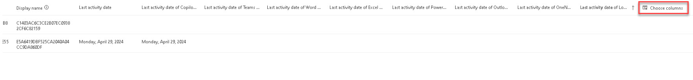

# Task 4.1: Review the Microsoft 365 Copilot usage report

1. In the Microsoft 365 admin center, on the left navigation, select **Reports** > **Usage**. 

 

1. On the left navigation, under **Reports**, select **Copilot for Microsoft 365**. 

 

1. Review the **Readiness** page. 

 

1. Select **Usage**. 

 

1. Select the **Filters** menu and notice the availability of the report retention. 

 
    {: .note }
    > Microsoft 365 usage reports show how people in your business are using Microsoft 365 services.
    > 
    > Reports are available for the last 7 days, 30 days, 90 days, and 180 days.
    > 
    > Data won't exist for all reporting periods right away. The reports become available within 48 hours. 

 

1. Under **Adoption**, select the **Product** menu to review the product options.   

 

1. Select the **Summary** view, hover over the bars in the chart for details. 

 

1. Select the **Trend** view, hover over the chart for details. 

 

1. Under **Copilot usage details**, review the table. 

 
   {: .important }
   > Notice that some of the information is concealed for privacy. 

 

1. Select **Choose columns**, the last column header on the table. 

 

     

 

1. Review the available settings and close the window. 
