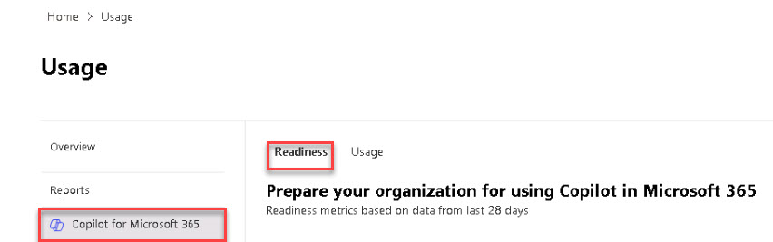

# Task 1.1: Access the Microsoft 365 Copilot Readiness dashboard

1. Open a browser and go to the Microsoft 365 admin center at **[https://admin.microsoft.com](https://admin.microsoft.com)** and sign in with your Global Admin credentials.

1. In the left navigation, select **Show all**. 

1. Select **Reports** > **Usage** 

1. On the **Usage** page navigation, under **Reports**, select **Copilot for Microsoft 365**.

1. Review the information on the **Readiness** tab.

    
