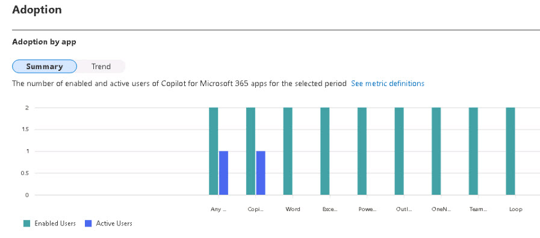

# Task 4.2: Access and filter the Copilot for Microsoft 365 usage report

1. Select the **Usage** tab.

1. In the **Copilot for Microsoft 365 usage** report, use the drop-down menu next to **Filters:** to select a time period. 

    {: .highlight }
    > You can choose from 7 days, 30 days, 90 days, or 180 days.

1. Under the **Adoption** section, select the **Summary** view and hover over the bars to see the breakdown of Microsoft 365 Copilot usage by product. 

    {: .important }
    > You can see the number of enabled users, active users, and active users rate for each product.
    
    

1. Select the **Trend** view and use the drop-down menu to select a product. 

    {: .important }
    > You can see the daily trend of Microsoft 365 Copilot usage for the selected product over the time period.

    

---
