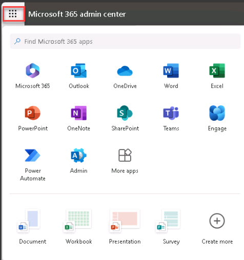

# Task 1.3: Export the report data into an Excel file

1. Scroll down to the **Copilot usage details** section and near the end of the table column headers, select **Choose columns** to add or remove columns from the table. You can customize the table to show only the columns that are relevant to you.

    

     {: .important }
    > This section shows the list of users who have Microsoft 365 Copilot licenses and their last activity date for each product. You can sort, filter, and search the table by any column.

1. Select **Export** to download the table.

1. Save the **.csv** file to your local drive or a cloud storage location. 

    {: .note }
    > You can open the file to see the report data in a tabular format.

1. Open the downloaded **.csv** file in Microsoft Excel. You  can use the built-in features of Excel to further analyze, visualize, and share the report data. 

    {: .important }
    > For example, you can create pivot tables, charts, or dashboards to highlight the key insights from the report data.
