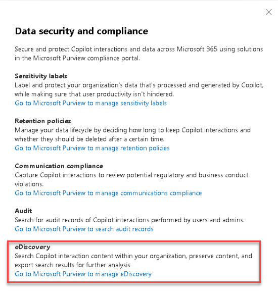
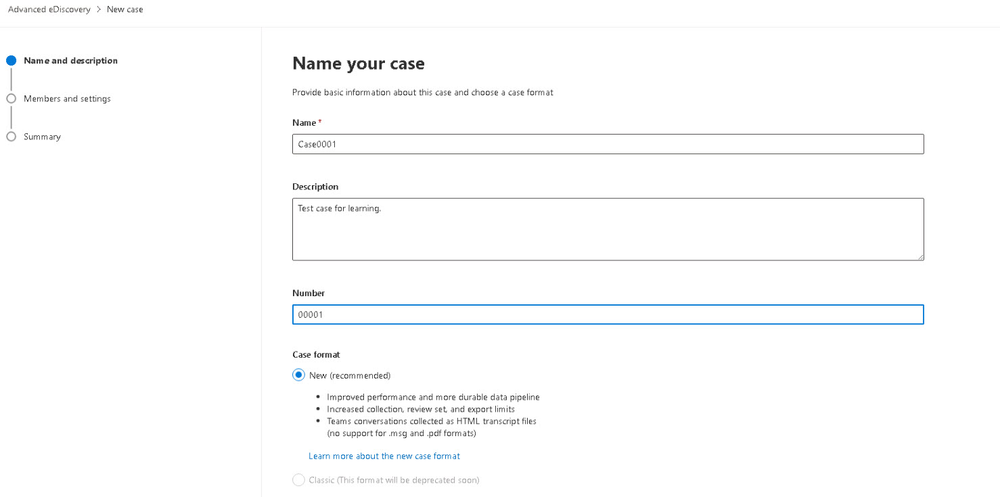

# Task 4.1: Manage eDiscovery (Standard) or (Premium) in Microsoft Purview

Electronic discovery, or eDiscovery, is the process of identifying and delivering electronic information that can be used as evidence in legal cases.  

You can use eDiscovery tools in Microsoft Purview to search for content in Exchange Online, OneDrive for Business, SharePoint Online, Microsoft Teams, Microsoft 365 Groups, and Viva Engage teams. 

You can search mailboxes and sites in the same eDiscovery search, and then export the search results. You can use Microsoft Purview eDiscovery (Standard) cases to identify, hold, and export content found in mailboxes and sites.  
 
If your organization has an Office 365 E5 or Microsoft 365 E5 subscription (or related E5 add-on subscriptions), you can further manage custodians and analyze content by using the feature-rich Microsoft Purview eDiscovery (Premium) solution in Microsoft 365. 

 

 

 

*Microsoft Purview provides three eDiscovery solutions: Content search, eDiscovery (Standard), and eDiscovery (Premium).* 

| Content Search | eDiscovery (Standard) | eDiscovery (Premium)    | 
|:---------|:---------|:---------| 
|  Search for content   | Search and export   | Custodian management    | 
| Keyword queries and search conditions   | Case management   | Legal hold notifications | 
| Export search results     | Legal hold          | Advanced indexing    | 
| Role-based permissions    |                       | Review set filtering | 
|                           |                       | Tagging      | 
|                           |                       | Analytics                | 
|                           |                       | Predictive coding models | 
|                           |                       | And more...  | 

 

{: .new }
> Review [Microsoft Purview eDiscovery solutions](https://learn.microsoft.com/en-us/purview/ediscovery "Microsoft Purview eDiscovery solutions") for more information and to review prerequisites. 

 

1. In the **Microsoft 365 admin center**, on the left menu, select **Copilot** > **Settings** > **Data security and compliance**. 

 

1. Under **eDiscovery**, select **Go to Microsoft Purview to manage eDiscovery**. 

 

     

 

1. On the left menu, under **Solutions**, expand **eDiscovery** and select **Premium**. 

 

1. Review the **Overview** page and select **Cases**. 

 

1. Select **+ Create a case**.  

 

1. Enter a name, description, and number. 

 

    >**Example:** 

     

 

1. Select **Next**. 

 

1. Add  **Users** or **Groups**, review the other settings, and then select **Next**. 

 

1. Review the configuration for the case and select **Submit**. 

 

1. Select **Done**. 

 

    {: .note }
    > If necessary, refresh the browser page to see the new case. 

 

1. Review the **Overview** page and then select the remaining pages to review the available settings. 

 
