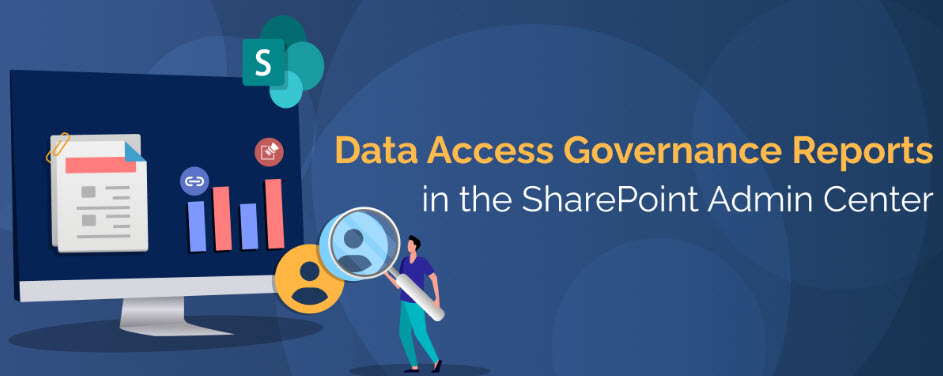
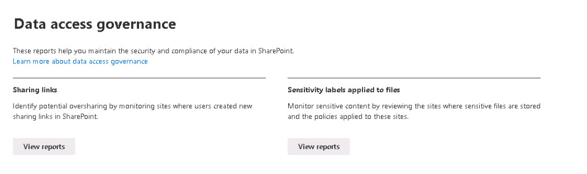

# Task 1.1: Access SharePoint Data Access Governance DAG

1. Open a browser and go to **[https://admin.microsoft.com/](https://admin.microsoft.com/)**.

1. Sign in with your credentials.

1. On the left menu, under **Admin centers**, select **SharePoint**.

1. In the **SharePoint admin center**, on the left menu, select **Reports** > **Data access governance** to access the DAG reports.  

    >{: .note }
    > The following reports are currently available: 
    >
    >- **Sharing links**
    >
    >- **Sensitivity labels applied files**
    >
    

