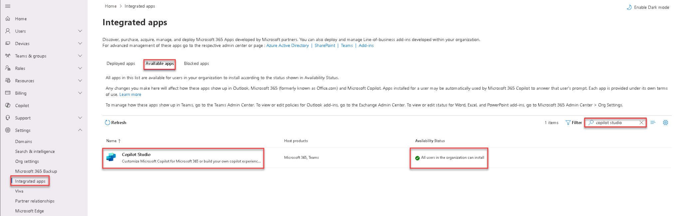
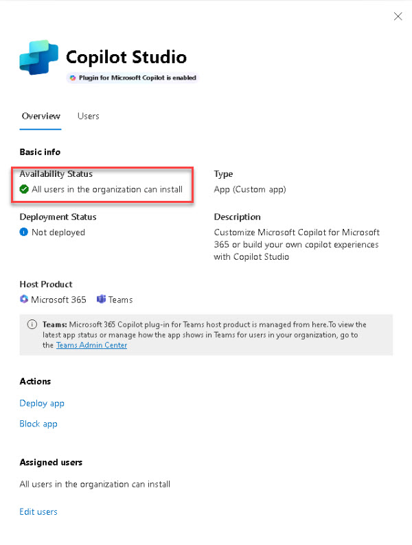

# Task 1.1: Login to your Copilot CDX Tenant and verify that All users in the Organization can install and use Copilot

 

1. Open a browser and go to [**Microsoft 365 admin center**](https://admin.microsoft.com "Microsoft 365 admin center"). Sign in with your credentials. 

 

1. On the left menu, select **Show all** > **Settings** > **Integrated apps**. 

 

1. Select the **Available apps** page and then search for and select **Copilot Studio**. 

 

     

 

1. On the flyout, review the information on the **Overview** page and verify that the **Copilot Studio Plugin for Microsoft Copilot** is enabled and available. 

 

         

 

1. Select **Users** and verify that **All users in the organization can install** is selected. Then close the flyout. 
