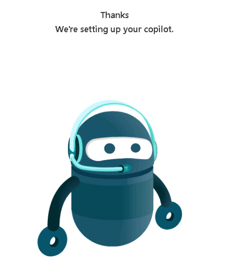

# Task 1.2: Go to Copilot Studio and create a custom copilot

 

1. Open a new browser tab and go to [Copilot Studio](https://copilotstudio.microsoft.com/ "Copilot Studio").  

 

1. On the **Copilot Studio** home page, on the left menu, select **Copilots**. 

 

1. Select **+ New copilot**. 

 

1. Enter **Technology Specialists** for the name and select the preferred language for the copilot to speak. 

 

1. Review the **Give your copilot some knowledge by setting up your Generative AI** section to learn about adding information from your website but do not enter a website at this time. 

 

1. Select **Edit advanced options >** and notice the available settings.  

 

1. Select **Create** and then wait for your copilot to complete setup. 

 

     

     

 
