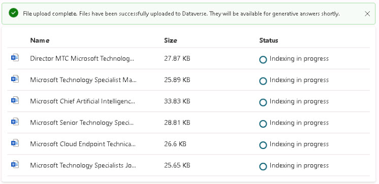
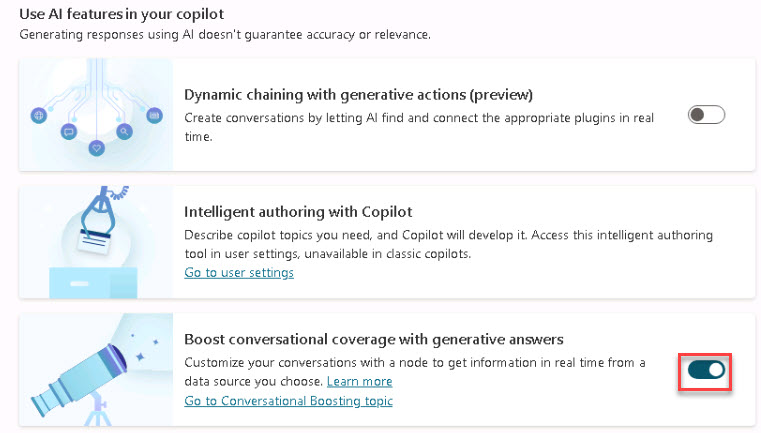

# Task 1.3: Download and upload artifacts  

 

1. Download and extract [**MicrosoftTechnologySpecialistJobPostings.zip**](https://github.com/microsoft/TechExcel-Elevate-your-Copilot-for-M365-technical-proficiency/blob/main/docs/resources/MicrosoftTechnologySpecialistJobPostings.zip) to your local machine.  

 

    {: .warning }
    > This folder comprises innocuous Word documents containing job-related information intended solely for illustrative purposes in this lab setting. 

 

1. Return to **Copilot Studio**. 

 

1. On the left menu, select **Generative AI**. 

 

1. Under **Upload a document**, upload the files downloaded in the previous task. 

 

     

     
    {: .warning }
    > This procedure may require several minutes to finalize. Please proceed with the next step and revisit the status later. 

 

1. Scroll down the page, and, under **Use AI features in your copilot**, enable **Boost conversational coverage with generative answers** to get information in real time. 

 

     

 
