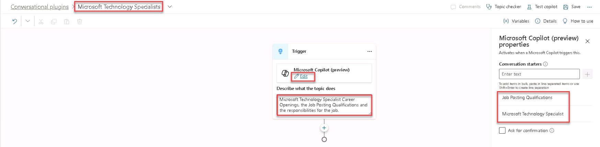
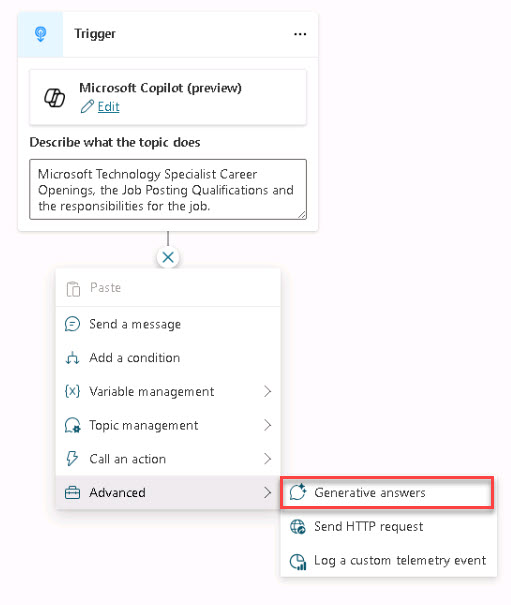
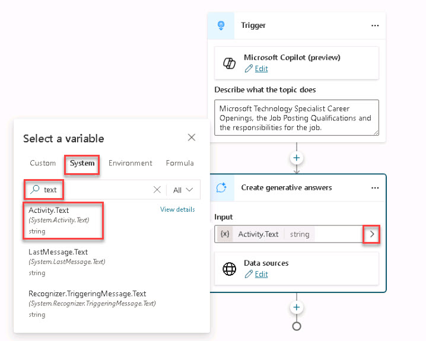

# Task 1.4: Add a Conversational Plugin

 

1. On the left menu, select **Extend Microsoft Copilot (preview)** > **Conversational plugins**. 

 

1. Select **Add a conversational plugins**. 

 

1. On the **Conversational plugins** page, in the breadcrumbs, select **Untitled** and change the name to **Microsoft Technology Specialists**.  

 

1. On the first **Trigger**, select **Edit** and enter the following **Conversation starters**: 

 

    - Microsoft Technology Specialist 

    - Job Posting Qualifications 

 

1. On the **Trigger**, enter a description about what the conversational plugin is doing. Enter the following:   

 

    - Microsoft Technology Specialist Career Openings, the Job Posting Qualifications and the responsibilities for the job. 

       

    {: .important }
    > It’s very important that you describe in detail what the topic does. Copilot Studio Conversational Plugins can trigger off the name of the Plugin and what you put in the description!    

 

     

 

1. Below the **Trigger** node, select **+** to add a node. 

 

1. Select **Advanced** > **Generative answers**. 

 

     

 

1. On the **Create generative answers** node under **Input** and to the right of the box, select **Select a variable** > **System**. 

 

1. Enter **text** into the search box and from the results, select **Activity.Text** string. 

 

     

 

1. Under **Data sources**, select **Edit** and review the information and close the Flyout.  

 

    {: .important }
    > For this use case, do not edit the Data Sources as we uploaded the Job Postings into Copilot Container which uses the Dataverse to store the documents. 

 

1. In the upper-right, select **Save**. 

 

    {: .warning }
    > Make sure to Save the Conversational Plugin. 

 
