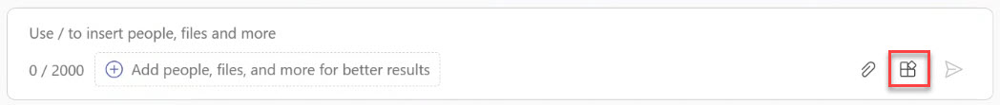

# Task 2.1: Enable the Conversational Plugin in Teams

1. Open **Teams**, or go to **[Microsoft Teams](https://teams.microsoft.com/v2/ "Microsoft Teams")** and sign in. 

 

1. On the left menu, select **Copilot**. 

 
    {: .highlight }
    > If necessary, select  **View more apps (...)** and select **Copilot**. On the left menu, right-click **Copilot** and select **Pin**.  

 

1. In the lower-right of the Copilot prompt, select **Plugins**. 

 

     

 

1. Verify that the **Microsoft Technology Specialists** conversational plugin is listed and enabled. 

 

     

 
