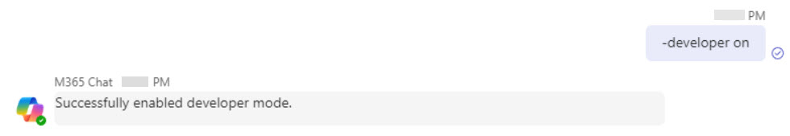

# Task 2.2: Turn on Developer Mode in Copilot in Teams

You can use *developer mode* for **M365 Chat** while testing your plugin to verify if and how the orchestrator selected your plugin for use in response to a given prompt. From *M365 Chat*, you can enable developer mode by typing **-developer on** (or **-developer off** to disable). 

 

1. In the Teams Copilot prompt, enter **-developer on**. 

 

     

 

    {: .important }
    > Developer mode is only available within M365 Chat (Copilot for Microsoft 365) experiences and doesn't surface in Microsoft Copilot (Copilot with Bing) chat.
    > 
    > For more info, see [Debugging plugin selection](https://learn.microsoft.com/en-us/microsoft-365-copilot/extensibility/orchestrator#debugging-plugin-selection "Debugging plugin selection"). 
