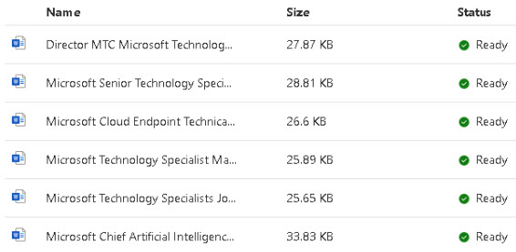
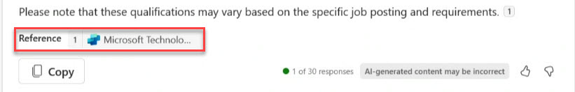

# Task 2.3: Test the Conversational Plugin with some prompts

 

1. Return to **Copilot Studio** > **Generative AI** and verify that the documents are uploaded.  

 

     

 

    {: .warning }
    > Do not proceed until all of the documents are ready. 

 

1. Return to **Teams**. 

 

1. Enter the following: **What are the qualifications for a Microsoft Technology Specialist?** 

 

    {: .note }
    > Notice the response, and the expanded section below showing the table with developer information.
    > You should see the Matched Functions call out the plugin, and the Function Execution Details show a status of Success.  

 

1. Enter the following: **What are the qualifications for a Microsoft Technology Manager role?** 

    {: .note }
    > Notice that in the response, it should show the Copilot Studio small icon with the name of the Copilot Studio Plugin, along with the job posting documents it referenced that we uploaded into the Dataverse for this plugin. 

    > 

     

  

1. Enter the following: **Are there any top secret Microsoft Technology opportunities?** 

 

1. Enter **-developer off** to turn off developer mode.
